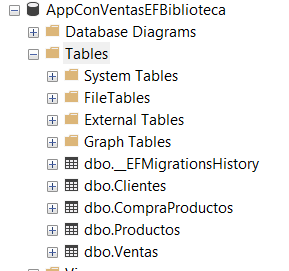

# PRACTICAS REPASO
 - Instalar Net Core.
 - Instalar un Editor de Codigo (Visual Studio Code, Visual studio 2022).
 - Crear un proyecto consola en net core.

---
---

# MODULO1: C# Net Core 6 - Desde Cero (con GitHub) 
## Introduccion: 
1. **.NET Framework**:
2. **.NET Core**:

## Primer proyecto
### **Requerimientos**

### **Aplicacion de Consola** Para crear un proyecto de consola en .NET Core 6, puedes seguir estos pasos:

- **Paso 1: Instala .NET Core 6**
- **Paso 2: Abre una Terminal o un Símbolo del Sistema**
- **Paso 3: Crea un Nuevo Proyecto de Consola**
- **Paso 4: Navega al Directorio del Proyecto**
- **Paso 5: Ejecuta la Aplicación de Consola**
- **Paso 6: Edita y Personaliza tu Proyecto**

## Estructuras de Control
- **If**
- **Switch**
- **For**
- **While**
- **Do While**

### Menu de opciones Aplicacion de Consola

## Orientación a Objetos
1. **Clases y Objetos**
2. **Instanciación de Objetos**
3. **Encapsulamiento**
4. **Herencia**
5. **Polimorfismo**
6. **Abstracción**

### Diseño de Aplicaciones de Consola
1. **Aplicación de Consola Interactiva**:
2. **Procesador de Datos en Línea de Comandos**:
3. **Herramienta de Línea de Comandos**:
4. **Demonio o Servicio de Consola**:
5. **Aplicación de Registro y Monitoreo**:
6. **Aplicación de Prueba y Depuración**:
7. **Aplicación de Configuración y Gestión**:

### Librerias clases
1. **Reutilización de Código**
2. **Modularidad**
3. **Separación de Responsabilidades**
4. **Versionamiento**
5. **Referenciación**
6. **Documentación**
7. **Testing**

**Para crear una biblioteca de clases en Visual Studio:**

### Diseño de Aplicaciones Windows (Windows Forms)

---
---
# MODULO2: C# .Net Core - Avanzado  (con GitHub)
1. **Introducción a las APIs REST**:
2. **Entorno de Desarrollo**:
3. **Fundamentos de C#**:
4. **ASP.NET Core**:
5. **Routing en ASP.NET Core**:
6. **Modelos de Datos**:
7. **Controladores y Acciones**:
8. **Métodos HTTP**:
9. **Serialización y Deserialización JSON**:
10. **Autenticación y Autorización**:
11. **Versionado de la API**:
12. **Documentación de la API**:
13. **Manejo de Errores**:
14. **Seguridad**:
15. **Buenas Prácticas de Desarrollo**:
16. **Gestion de Paquetes con Nuget**
17. **Conexion a Base de datos ADO.NET**
18. **Bases de datos con Entity Framework**
19. **Aplicaciones Web**
---
---
# MISCELANEOS
### Commando Dotnet
### Commando GitHub
---
---
***
# Recursos
 - https://github.com/vachocalla/CourseM1CSharp
 - https://code.visualstudio.com/download
 - https://visualstudio.microsoft.com/es/vs/community/
 - https://git-scm.com/downloads

# C# Net Core 6 - Desde Cero (con GitHub) 

# Día 1

## Introduccion: 
La diferencia principal entre ".NET Framework" y ".NET Core" se refiere a su diseño, propósito y compatibilidad. Aquí tienes una descripción de ambas:

1. **.NET Framework**:

   - Es un framework de desarrollo de software desarrollado por Microsoft que ha estado disponible durante varias décadas y se ha utilizado principalmente en sistemas operativos Windows.
   - Fue diseñado inicialmente como un framework para aplicaciones Windows y de escritorio, y posteriormente se amplió para admitir aplicaciones web a través de ASP.NET.
   - Está diseñado para ser una plataforma integral para el desarrollo de aplicaciones Windows, incluyendo aplicaciones de escritorio (Windows Forms y WPF), servicios de Windows, aplicaciones web ASP.NET, y más.
   - Está vinculado al sistema operativo Windows y se distribuye como parte del sistema operativo o como una descarga independiente.

2. **.NET Core**:

   - Es una plataforma de desarrollo de software de código abierto y multiplataforma también desarrollada por Microsoft.
   - Fue diseñado para ser más liviano y modular en comparación con .NET Framework. Esto significa que puedes elegir componentes específicos y dependencias para incluir en tu aplicación, lo que la hace más eficiente y adecuada para escenarios como contenedores y aplicaciones web modernas.
   - Es completamente multiplataforma y se ejecuta en Windows, Linux y macOS. Esto lo hace ideal para desarrollar aplicaciones en una variedad de sistemas operativos.
   - A partir de .NET Core 3.0, Microsoft unificó las plataformas .NET Framework y .NET Core bajo el nombre ".NET", lo que significa que .NET Core se convirtió en la base de la nueva plataforma .NET. 

## Primer proyecto

### **Requerimientos**
- Instalar: 
    - https://dotnet.microsoft.com/es-es/download/dotnet/6.0 (Recomendado)
    - https://dotnet.microsoft.com/es-es/download/dotnet/7.0 
    - https://dotnet.microsoft.com/es-es/download/dotnet/8.0 (Recomendado)

### **Aplicacion de Consola** Para crear un proyecto de consola en .NET Core 6, puedes seguir estos pasos:

- **Paso 1: Instala .NET Core 6**

    Asegúrate de tener instalado .NET Core 6 en tu máquina. Puedes descargarlo desde el sitio web oficial de .NET: https://dotnet.microsoft.com/download/dotnet/6.0

- **Paso 2: Abre una Terminal o un Símbolo del Sistema**

    Abre una terminal o un símbolo del sistema en tu sistema operativo. Esto es donde ejecutarás los comandos de .NET Core para crear y ejecutar tu proyecto de consola.

- **Paso 3: Crea un Nuevo Proyecto de Consola**

    Ejecuta el siguiente comando para crear un nuevo proyecto de consola en .NET Core 6. Reemplaza `"MiProyectoConsola"` con el nombre que desees para tu proyecto:

    ```bash
    dotnet --list-sdks

    dotnet new console -n MiProyectoConsola

    dotnet new console -n <nombre_del_proyecto> --framework net6.0
    ```

    Este comando crea un nuevo proyecto de consola llamado "MiProyectoConsola".

- **Paso 4: Navega al Directorio del Proyecto**

    Utiliza el comando `cd` para cambiar al directorio del proyecto que acabas de crear:

    ```bash
    cd MiProyectoConsola
    ```

- **Paso 5: Ejecuta la Aplicación de Consola**

    Una vez que estés dentro del directorio de tu proyecto, puedes compilar y ejecutar la aplicación de consola utilizando el siguiente comando:

    ```bash
    dotnet run
    ```

    Esto compilará y ejecutará tu aplicación de consola. Verás la salida en la terminal.

- **Paso 6: Edita y Personaliza tu Proyecto**

    Ahora puedes abrir el proyecto en tu editor de código favorito (como Visual Studio Code o Visual Studio) y comenzar a editar y personalizar tu aplicación de consola en C# según tus necesidades.

    El archivo principal de la aplicación de consola es `Program.cs`, y es donde encontrarás el método `Main`, que es el punto de entrada de tu programa.

## Estructuras de Control
- **If**
    ```csharp
    public static void EjemploIf()
    {
        int edad = 25;

        if (edad >= 18)
        {
            Console.WriteLine("Eres mayor de edad.");
        }
        else
        {
            Console.WriteLine("Eres menor de edad.");
        }
    }
    ```

- **Switch**
    ```csharp
    public static void EjemploSwitch()
    {
        int diaSemana = 3;
        string nombreDia;

        switch (diaSemana)
        {
            case 1:
                nombreDia = "Lunes";
                break;
            case 2:
                nombreDia = "Martes";
                break;
            case 3:
                nombreDia = "Miércoles";
                break;
            default:
                nombreDia = "Día no válido";
                break;
        }

        Console.WriteLine($"Hoy es {nombreDia}.");
    }
    ```

- **For**
    ```csharp
    public static void EjemploFor()
    {
        for (int i = 1; i <= 5; i++)
        {
            Console.WriteLine($"Iteración {i}");
        }
    }
    ```

- **While**
    ```csharp
    public static void EjemploWhile()
    {
        int contador = 0;

        while (contador < 5)
        {
            Console.WriteLine($"Contador: {contador}");
            contador++;
        }
    }
    ```

- **Do While**
    ```csharp
    public static void EjemploDoWhile()
    {
        int contador = 0;

        do
        {
            Console.WriteLine($"Contador: {contador}");
            contador++;
        } while (contador < 5);
    }
    ```

### Menu de opciones
Usando los anteriores metodos crear un menu para invocar a cada unos de los metodos creados.

Ejemplo Completo en URL: 

```csharp
using System;

public class Program
{
    public static void Main(string[] args)
    {
        while (true)
        {
            Console.WriteLine("Seleccione una opción:");
            Console.WriteLine("1. Ejemplo de if");
            Console.WriteLine("2. Ejemplo de switch");
            Console.WriteLine("3. Ejemplo de for");
            Console.WriteLine("4. Ejemplo de while");
            Console.WriteLine("5. Ejemplo de do-while");
            Console.WriteLine("0. Salir");

            int opcion;
            if (int.TryParse(Console.ReadLine(), out opcion))
            {
                switch (opcion)
                {
                    case 1:
                        EjemploIf();
                        break;
                    case 2:
                        EjemploSwitch();
                        break;
                    case 3:
                        EjemploFor();
                        break;
                    case 4:
                        EjemploWhile();
                        break;
                    case 5:
                        EjemploDoWhile();
                        break;
                    case 0:
                        return; // Salir del programa
                    default:
                        Console.WriteLine("Opción no válida. Inténtelo de nuevo.");
                        break;
                }
            }
            else
            {
                Console.WriteLine("Opción no válida. Inténtelo de nuevo.");
            }
        }
    }
}
```

# Día 2

### Clases y Objetos
La programación orientada a objetos (POO) es un paradigma de programación fundamental en C# y .NET Core 6. En la POO, los programas se organizan en objetos que representan entidades del mundo real y las interacciones entre ellos.

1. **Clases y Objetos**:
   - Una clase es una plantilla o un plano para crear objetos. Define los atributos (propiedades) y los métodos (funciones) que los objetos de esa clase tendrán.
   - Un objeto es una instancia de una clase, es decir, una entidad concreta creada a partir de una clase.

   ```csharp
   // Definición de una clase
   public class Persona
   {
       // Atributos (propiedades)
       public string Nombre { get; set; }
       public int Edad { get; set; }

       // Método
       public void Saludar()
       {
           Console.WriteLine($"Hola, soy {Nombre} y tengo {Edad} años.");
       }
   }

   // Creación de un objeto
   Persona persona1 = new Persona();
   persona1.Nombre = "Juan";
   persona1.Edad = 30;
   persona1.Saludar(); // Llamada a un método
   ```
2. **Instanciación de Objetos**:
   - Los objetos se crean utilizando el operador `new`.
   - Los objetos pueden ser destruidos automáticamente por el recolector de basura de .NET cuando ya no son accesibles.

   ```csharp
   Persona persona = new Persona();
   ```

3. **Encapsulamiento**:
   - El encapsulamiento es el principio de POO que implica ocultar los detalles internos de una clase y exponer solo las interfaces necesarias.
   - En C#, se utilizan modificadores de acceso como `public`, `private`, `protected`, etc., para controlar la visibilidad de atributos y métodos.

        - **`public`**:
            - Es el modificador de acceso más permisivo.
            - Los miembros públicos son accesibles desde cualquier parte del código, tanto dentro como fuera de la clase en la que se definen.
            - Es útil para los miembros que deben ser accesibles desde otras partes del programa, como interfaces públicas de una clase.

        - **`private`**:
            - Es el modificador de acceso más restrictivo.
            - Los miembros privados solo son accesibles dentro de la propia clase en la que se definen.
            - Se utiliza para ocultar la implementación interna de una clase y para evitar el acceso directo desde fuera de la clase.

        - **`protected`**:
            - Los miembros protegidos son similares a los miembros privados en el sentido de que no son accesibles desde fuera de la clase.
            - Sin embargo, los miembros protegidos son accesibles en clases derivadas (subclases) de la clase en la que se definen.
            - Se utiliza para permitir que las subclases hereden y utilicen ciertos miembros, pero aún así los oculta de otros códigos externos.   

   ```csharp
   public class CuentaBancaria
   {
       private decimal saldo;

       public decimal Saldo
       {
           get { return saldo; }
           private set { saldo = value; }
       }

       public void Depositar(decimal cantidad)
       {
           saldo += cantidad;
       }

       public void Retirar(decimal cantidad)
       {
           if (cantidad <= saldo)
               saldo -= cantidad;
           else
               Console.WriteLine("Saldo insuficiente.");
       }
   }
   ```

4. **Herencia**:
   - La herencia permite que una clase (subclase o derivada) herede atributos y métodos de otra clase (superclase o base).
   - C# admite la herencia única, lo que significa que una clase solo puede heredar de una sola clase base.

   ```csharp
   public class Empleado : Persona
   {
       public decimal Salario { get; set; }
   }
   ```

5. **Polimorfismo**:
   - El polimorfismo permite que objetos de diferentes clases respondan de manera diferente a la misma llamada de método.
   - Se puede lograr mediante la sobrecarga de métodos y la implementación de interfaces.

   ```csharp
   public interface IVehiculo
   {
       void Arrancar();
   }

   public class Coche : IVehiculo
   {
       public void Arrancar()
       {
           Console.WriteLine("El coche arrancó.");
       }
   }

   public class Moto : IVehiculo
   {
       public void Arrancar()
       {
           Console.WriteLine("La moto arrancó.");
       }
   }
   ```

6. **Abstracción**:
   - La abstracción consiste en representar los aspectos esenciales de un objeto mientras se ocultan los detalles no esenciales.
   - Se logra mediante la creación de clases abstractas e interfaces.

   ```csharp
    using System;

    // Definición de una clase abstracta
    abstract class Vehiculo
    {
        // Propiedades
        public string Marca { get; set; }
        public string Modelo { get; set; }

        // Constructor
        public Vehiculo(string marca, string modelo)
        {
            Marca = marca;
            Modelo = modelo;
        }

        // Método abstracto que debe ser implementado por las clases derivadas
        public abstract void Arrancar();

        // Método común que no es abstracto
        public void Detener()
        {
            Console.WriteLine("El vehículo se ha detenido.");
        }
    }

    // Clase derivada que hereda de Vehiculo
    class Coche : Vehiculo
    {
        public Coche(string marca, string modelo) : base(marca, modelo)
        {
        }

        // Implementación del método abstracto
        public override void Arrancar()
        {
            Console.WriteLine($"El coche {Marca} {Modelo} ha arrancado.");
        }
    }

    // Clase derivada que hereda de Vehiculo
    class Motocicleta : Vehiculo
    {
        public Motocicleta(string marca, string modelo) : base(marca, modelo)
        {
        }

        // Implementación del método abstracto
        public override void Arrancar()
        {
            Console.WriteLine($"La motocicleta {Marca} {Modelo} ha arrancado.");
        }
    }

    class Program
    {
        static void Main()
        {
            Coche coche = new Coche("Ford", "Focus");
            Motocicleta moto = new Motocicleta("Honda", "CBR");

            coche.Arrancar(); // Llama al método Arrancar de Coche
            coche.Detener();  // Llama al método Detener de Vehiculo

            moto.Arrancar();  // Llama al método Arrancar de Motocicleta
            moto.Detener();   // Llama al método Detener de Vehiculo
        }
    }
    ```

## Ejemplo de una aplicacion consola para ventas.
```csharp
using System;
using System.Collections.Generic;

// Clase Cliente
class Cliente
{
    // Propiedades
    public int Id { get; set; }
    public string Nombre { get; set; }
    public string Email { get; set; }
    public string Telefono { get; set; }

    // Constructor
    public Cliente(int id, string nombre, string email, string telefono)
    {
        Id = id;
        Nombre = nombre;
        Email = email;
        Telefono = telefono;
    }
}

// Clase Producto
class Producto
{
    // Propiedades
    public int Id { get; set; }
    public string Nombre { get; set; }
    public string Descripcion { get; set; }

    // Constructor
    public Producto(int id, string nombre, string descripcion)
    {
        Id = id;
        Nombre = nombre;
        Descripcion = descripcion;
    }
}

// Clase Venta
class Venta
{
    // Propiedades
    public int Id { get; set; }
    public Cliente Cliente { get; set; }
    public List<Producto> Productos { get; set; }
    public DateTime FechaVenta { get; set; }

    // Constructor
    public Venta(int id, Cliente cliente, List<Producto> productos, DateTime fechaVenta)
    {
        Id = id;
        Cliente = cliente;
        Productos = productos;
        FechaVenta = fechaVenta;
    }

    // Método para calcular el total de la venta
    public decimal CalcularTotal()
    {
        decimal total = 0;
        foreach (var producto in Productos)
        {
            // Supongamos que cada producto tiene un precio (no se muestra aquí en la clase Producto)
            total += ObtenerPrecioProducto(producto);
        }
        return total;
    }

    private decimal ObtenerPrecioProducto(Producto producto)
    {
        // Aquí podrías implementar lógica para obtener el precio del producto
        // Puedes usar una base de datos o una lista de precios, por ejemplo.
        // Por simplicidad, asumiremos que cada producto tiene un precio fijo.
        return 10.0M; // Precio de ejemplo
    }
}

class Program
{
    static void Main()
    {
        // Crear clientes
        Cliente cliente1 = new Cliente(1, "Juan Perez", "juan@example.com", "123-456-7890");
        Cliente cliente2 = new Cliente(2, "María Rodriguez", "maria@example.com", "987-654-3210");

        // Crear productos
        Producto producto1 = new Producto(101, "Producto A", "Descripción del Producto A");
        Producto producto2 = new Producto(102, "Producto B", "Descripción del Producto B");

        // Crear una venta
        List<Producto> productosVenta1 = new List<Producto> { producto1, producto2 };
        Venta venta1 = new Venta(1001, cliente1, productosVenta1, DateTime.Now);

        // Calcular el total de la venta
        decimal totalVenta1 = venta1.CalcularTotal();

        // Imprimir información de la venta
        Console.WriteLine("Información de la Venta:");
        Console.WriteLine($"ID de Venta: {venta1.Id}");
        Console.WriteLine($"Cliente: {venta1.cliente.Nombre}");
        Console.WriteLine("Productos:");
        foreach (var producto in venta1.Productos)
        {
            Console.WriteLine($"- {producto.Nombre}: {ObtenerPrecioProducto(producto):C}");
        }
        Console.WriteLine($"Total de la Venta: {totalVenta1:C}");
    }

    private static decimal ObtenerPrecioProducto(Producto producto)
    {
        // Aquí podrías implementar la lógica real para obtener el precio del producto.
        // En este ejemplo, se usa un precio fijo.
        return 10.0M; // Precio de ejemplo
    }
}
```

# Día 3
### Mejora de Clases: Aplicacion Ventas

 - Clase Cliente
    ```csharp
    public class Cliente
    {
        // Propiedades
        public long id { get; set; }
        public string nombre { get; set; }
        public string email { get; set; }
        public string telefono { get; set; }

        // Constructor
        public Cliente(){}
        public Cliente(
            /*long clienteId, */
            string clienteNombre, 
            string clienteEmail, 
            string clienteTelefono)
        {
            //id = clienteId;
            id = DateTime.Now.Ticks / TimeSpan.TicksPerMillisecond;
            nombre = clienteNombre;
            email = clienteEmail;
            telefono = clienteTelefono;
        }
        public string toString(){
            //Console.WriteLine($"{id}\t{nombre}\t{email}\t{telefono}");
            return $"{id}\t{nombre}\t{email}\t{telefono}";
        }

        public void leer(){
            //id = System.CurrentMilliseconds.
            Console.WriteLine("INGRESAR CLIENTE:");
            //Console.Write("Id:");
            //id = long.Parse(Console.ReadLine());
            id = DateTime.Now.Ticks / TimeSpan.TicksPerMillisecond;
            Console.Write("Nombre:");
            nombre = Console.ReadLine();
            Console.Write("Email:");
            email = Console.ReadLine();
            Console.Write("Telefono:");
            telefono = Console.ReadLine();
        }
    }
    ```

 - Clase Producto
    ```csharp
    public class Producto
    {
        // Propiedades
        public long id { get; set; }
        public string nombre { get; set; }
        public string descripcion { get; set; }
        public decimal precio { get; set; }

        // Constructor
        public Producto(){
        }
        public Producto(
            /*long productoId, */
            string productoNombre, 
            string productoDescripcion, 
            decimal productoPrecio)
        {
            //id = productoId;
            id = DateTime.Now.Ticks / TimeSpan.TicksPerMillisecond;
            nombre = productoNombre;
            descripcion = productoDescripcion;
            precio = productoPrecio;
        }

        public string toString(){
            return $"{id}\t{nombre}\t{descripcion}\t{precio}";
        }

        public void leer(){
            //id = System.CurrentMilliseconds.
            Console.WriteLine("INGRESE PRODUCTO:");
            //Console.Write("Id:");
            //id = long.Parse(Console.ReadLine());
            id = DateTime.Now.Ticks / TimeSpan.TicksPerMillisecond;
            Console.Write("Nombre:");
            nombre = Console.ReadLine();
            Console.Write("Descripcion:");
            descripcion = Console.ReadLine();
            Console.Write("Precio:");
            precio = decimal.Parse(Console.ReadLine());
        }
    }
    ```

 - Clase CompraProducto
    ```csharp
    public class CompraProducto
    {
        // Propiedades
        public long id { get; set; }
        public Producto producto { get; set; }
        public int cantidad { get; set; }

        // Constructor
        public CompraProducto(
            /*long compraProductoId, */
            Producto compraProductoProducto, 
            int compraProductoCantidad)
        {
            //id = compraProductoId;
            id = DateTime.Now.Ticks / TimeSpan.TicksPerMillisecond;
            producto = compraProductoProducto;
            cantidad = compraProductoCantidad;
        }

        public decimal costoCompra(){
            return producto.precio * cantidad;
        }

        public string toString(){
            return $"{id} \t{producto.nombre} \t{producto.precio} \t{cantidad} \t{costoCompra()}";
        }
    }
    ```
 - Clase Venta
    ```csharp
    public class Venta
    {
        // Propiedades
        public long id { get; set; }
        public Cliente cliente { get; set; }
        public List<CompraProducto> compraProductos { get; set; }
        public DateTime fechaVenta { get; set; }

        // Constructor
        public Venta(
            /*long ventaId, */
            Cliente ventaCliente, 
            List<CompraProducto> ventaCompraProductos, 
            DateTime ventaFechaVenta)
        {
            //id = ventaId;
            id = DateTime.Now.Ticks / TimeSpan.TicksPerMillisecond;
            cliente = ventaCliente;
            compraProductos = ventaCompraProductos;
            fechaVenta = ventaFechaVenta;
        }

        public void mostrarDetalleVenta()
        {
            Console.WriteLine($"Cliente: {cliente.nombre}");
            Console.WriteLine($"Productos Comprados:");
            decimal total = 0;
            foreach (var compraProducto in compraProductos)
            {
                Console.WriteLine($"\t {compraProducto.toString()}");
                total = total + compraProducto.costoCompra();
            }
            Console.WriteLine($"Total Compra: {total}");
        }

    }
    ```
 - Clase Principal Program
    ```csharp
    public class Program
    {
        public static List<Cliente> clientes = new List<Cliente>();
        public static List<Producto> productos = new List<Producto>();
        public static List<Venta> ventas = new List<Venta>();
        public static void Main(string[] args)
        {
            while (true)
            {
                Console.WriteLine("\n\nMENU \n Seleccione una opción:");
                Console.WriteLine("1. Registrar Cliente");
                Console.WriteLine("2. Mostrar Clientes");
                Console.WriteLine("3. Registrar Producto");
                Console.WriteLine("4. Mostrar Productos");
                Console.WriteLine("5. Realizar Compra/Venta");
                Console.WriteLine("6. Mostrar Ventas");
                Console.WriteLine("0. Salir");

                int opcion;
                if (int.TryParse(Console.ReadLine(), out opcion))
                {
                    switch (opcion)
                    {
                        case 1:
                            Cliente c1 = new Cliente();
                            c1.leer();
                            clientes.Add(c1);
                            break;
                        case 2:
                            mostrarClientes();
                            break;
                        case 3:
                            Producto p1 = new Producto();
                            p1.leer();
                            productos.Add(p1);
                            break;
                        case 4:
                            mostrarProductos();
                            break;
                        case 5:
                            compraVenta();
                            break;
                        case 6:
                            mostrarVentas();
                            break;
                        case 0:
                            return; // Salir del programa
                        default:
                            Console.WriteLine("Opción no válida. Inténtelo de nuevo.");
                            break;
                    }
                }
                else
                {
                    Console.WriteLine("Opción no válida. Inténtelo de nuevo.");
                }
            }
        }

        public static void mostrarClientes(){
            Console.WriteLine( "\nCLIENTES" );
            Console.WriteLine( "No\tId\t\tNombre\tEmail\tTelefono" );
            var index = 1;
            foreach (var cliente in clientes) {
                Console.WriteLine( $"{index} \t{cliente.toString()}" );
                index++;
            }
        }
        public static void mostrarProductos(){
            Console.WriteLine( "\nPRODUCTOS" );
            Console.WriteLine( "No\tId\t\tNombre\tDescripcion\tPrecio" );
            var index = 1;
            foreach (var producto in productos) {
                Console.WriteLine( $"{index} \t{producto.toString()}" );
                index++;
            }
        }
        public static void compraVenta(){
            Console.WriteLine("\nCOMPRA VENTA");
            mostrarClientes();
            Console.Write("Seleccione el No de Persona que Compra:");
            int noCliente = int.Parse( Console.ReadLine() ) ;
            Cliente cliente = clientes[noCliente-1];
            List<CompraProducto> compraProductos = new List<CompraProducto>();

            while (true)
            {
                Console.WriteLine("\n\nMENU \n Seleccione una opción:");
                Console.WriteLine("1. Agregar Producto a Comprar");
                Console.WriteLine("0. Compra Compleda");

                int opcion;
                if (int.TryParse(Console.ReadLine(), out opcion))
                {
                    switch (opcion)
                    {
                        case 1:
                            Console.WriteLine("\nCOMPRA VENTA");
                            mostrarProductos();
                            Console.Write("Seleccione el No de Producto a Comprar:");
                            int noProducto = int.Parse( Console.ReadLine() ) ;
                            Console.Write("Ingrese Cantidad a Comprar:");
                            int cantidad = int.Parse( Console.ReadLine() ) ;
                            CompraProducto cp = new CompraProducto(productos[noProducto-1], cantidad);
                            compraProductos.Add( cp );
                            break;
                        //case 0:
                        //    return; // Salir del programa
                        default:
                            Console.WriteLine("Opción no válida. Inténtelo de nuevo.");
                            break;
                    }
                }
                else
                {
                    Console.WriteLine("Opción no válida. Inténtelo de nuevo.");
                }
                if(opcion==0){
                    break;
                }
            }

            Venta venta = new Venta( cliente,compraProductos, DateTime.Now);
            ventas.Add(venta);
        }

        public static void mostrarVentas(){
            Console.WriteLine( "\nTODAS LAS VENTAS" );
            foreach (var venta in ventas) {
                venta.mostrarDetalleVenta();
            }
        }
        
    }
    ```


#### Compra Venta de productos


# Día 4 
## Implementacion: Aplicacion Ventas con Entity Framework


Para crear una aplicacion de Ventas en consola en C# .NET 6, agregar Entity Framework y generar el contexto de Entity Framework mediante los siguientes pasps:

**Paso 1: Crear un Proyecto de Consola**

1. Abre tu terminal o línea de comandos.

2. Navega al directorio donde desees crear el proyecto de consola.

3. Ejecuta el siguiente comando para crear un nuevo proyecto de consola:

   ```bash
   dotnet new console -n AppConsolaVentasEF
   ```

   Esto creará un proyecto de consola llamado "AppConsolaVentasEF".

**Paso 2: Agregar Entity Framework Core**

1. Navega al directorio del proyecto recién creado:

   ```bash
   cd MiProyectoDeConsola
   ```

2. Agrega el paquete Entity Framework Core para SQL Server a tu proyecto con el siguiente comando:

   ```bash
   dotnet add package Microsoft.EntityFrameworkCore.SqlServer
   dotnet add package Microsoft.EntityFrameworkCore.Design
   dotnet add package Microsoft.EntityFrameworkCore
   dotnet add package Microsoft.EntityFrameworkCore.Tools
   ```

**Paso 3: Definir los Modelos de Datos**

1. Define las clases que representarán tus modelos de datos Segun la IMagen. crear clases como `Cliente`, `Producto`, `CompraProducto`, `Venta`., con propiedades que mapeen las columnas de tus tablas en la base de datos.

    ```csharp
   using System;
    using System.ComponentModel.DataAnnotations;

    public class Cliente
    {
        // Propiedades
        [Key]
        public long id { get; set; }
        public string? nombre { get; set; }
        public string? email { get; set; }
        public string? telefono { get; set; }

        public string toString(){
            return $"{id}\t{nombre}\t{email}\t{telefono}";
        }

        public void leer(){
            Console.WriteLine("INGRESAR CLIENTE:");
            Console.Write("Nombre:");
            nombre = Console.ReadLine();
            Console.Write("Email:");
            email = Console.ReadLine();
            Console.Write("Telefono:");
            telefono = Console.ReadLine();
        }
    }
   ```

   ```csharp   
    using System;
    using System.ComponentModel.DataAnnotations;

    public class Producto
    {
        [Key]
        public long id { get; set; }
        public string nombre { get; set; }
        public string descripcion { get; set; }
        public decimal precio { get; set; }

        public string toString(){
            return $"{id}\t{nombre}\t{descripcion}\t{precio}";
        }

        public void leer(){
            Console.WriteLine("INGRESE PRODUCTO:");
            Console.Write("Nombre:");
            nombre = Console.ReadLine();
            Console.Write("Descripcion:");
            descripcion = Console.ReadLine();
            Console.Write("Precio:");
            precio = decimal.Parse(Console.ReadLine());
        }
    }
   ```

   ```csharp   
    using System;
    using System.ComponentModel.DataAnnotations;
    public class CompraProducto
    {
        [Key]
        public long id { get; set; }
        public Producto producto { get; set; }
        public int cantidad { get; set; }

        public decimal costoCompra(){
            return producto.precio * cantidad;
        }

        public string toString(){
            return $"{id} \t{producto.nombre} \t{producto.precio} \t{cantidad} \t{costoCompra()}";
        }
    }
   ```

   ```csharp   
    using System;
    using System.ComponentModel.DataAnnotations;

    public class Venta
    {
        [Key]
        public long id { get; set; }
        public Cliente cliente { get; set; }
        public List<CompraProducto> compraProductos { get; set; }
        public DateTime fechaVenta { get; set; }

        public void mostrarDetalleVenta()
        {
            Console.WriteLine($"Cliente: {cliente.nombre}");
            Console.WriteLine($"Productos Comprados:");
            decimal total = 0;
            foreach (var compraProducto in compraProductos)
            {
                Console.WriteLine($"\t {compraProducto.toString()}");
                total = total + compraProducto.costoCompra();
            }
            Console.WriteLine($"Total Compra: {total}");
        }

    }
   ```

**Paso 4: Crear el Contexto de Entity Framework**

1. Crea una clase que herede de `DbContext` para definir el contexto de Entity Framework. Añade esta clase al proyecto. Por ejemplo, puedes llamarla `ApplicationDbContext`.

   ```csharp   
    using Microsoft.EntityFrameworkCore;
    public class ApplicationDbContext : DbContext{
        public DbSet<Cliente> Clientes {get; set;}
        public DbSet<Producto> Productos {get; set;}
        public DbSet<CompraProducto> CompraProductos {get; set;}
        public DbSet<Venta> Ventas {get; set;}
    }
   ```

   Asegúrate de agregar las propiedades `DbSet` para cada uno de tus modelos.

**Paso 5: Configurar la Cadena de Conexión**

1. En la clase `ApplicationDbContext`, sobreescribe el método `OnConfiguring` para configurar la cadena de conexión a tu base de datos SQL Server. Reemplaza `"TuCadenaDeConexion"` con la cadena de conexión adecuada.

    - Server=Local; 
    - Database=Nombre de La Base de datos;
    - Integrated Security=True; 
    - Encrypt=false;

   ```csharp
   protected override void OnConfiguring( DbContextOptionsBuilder optionsBuilder ){
        if( !optionsBuilder.IsConfigured ){
            optionsBuilder.UseSqlServer("Server=LAPTOP-A7F9UEK5\\SQLEXPRESS; Database=AppConVentasEF; Integrated Security=True; Encrypt=false;");
        }
    }
   ```

**Paso 5.5: Instalacion dotnet ef**

1. Abre una terminal en la ubicación de tu proyecto y ejecuta el siguiente:

   ```bash
   dotnet tool install --global dotnet-ef
   ```

   Esto instalara la herramienta en el sistema.

**Paso 6: Generar las Migraciones**

1. Abre una terminal en la ubicación de tu proyecto y ejecuta el siguiente comando para generar una migración inicial:

   ```bash
   dotnet ef migrations add Inicial
   ```

   Esto generará una migración inicial basada en tus modelos.

**Paso 7: Aplicar las Migraciones a la Base de Datos**

1. Ejecuta el siguiente comando para aplicar las migraciones a la base de datos:

   ```bash
   dotnet ef database update
   ```

   Esto creará la base de datos según las migraciones que hayas definido.

**Paso 8: Usar el Contexto de Entity Framework**

1. En tu programa principal (en el archivo `Program.cs`), crea una instancia del contexto de Entity Framework y úsala para interactuar con la base de datos y aplicarla a un menu de interacccion.

    ```csharp
    public class Program{
        public static void Main(string[] args){
            using var context = new ApplicationDbContext();
            
            while (true)
            {
                Console.WriteLine("\n\nMENU \n Seleccione una opción:");
                Console.WriteLine("1. Registrar Cliente");
                Console.WriteLine("2. Mostrar Clientes");
                Console.WriteLine("3. Registrar Producto");
                Console.WriteLine("4. Mostrar Productos");
                Console.WriteLine("5. Realizar Compra/Venta");
                Console.WriteLine("6. Mostrar Ventas");
                Console.WriteLine("0. Salir");

                int opcion;
                if (int.TryParse(Console.ReadLine(), out opcion))
                {
                    switch (opcion)
                    {
                        case 1:
                            Cliente c1 = new Cliente();
                            c1.leer();
                            context.Clientes.Add( c1 );
                            context.SaveChanges();
                            break;
                        case 2:
                            mostrarClientes(context);
                            break;
                        case 3:
                            Producto p1 = new Producto();
                            p1.leer();
                            context.Productos.Add( p1 );
                            context.SaveChanges();
                            break;
                        case 4:
                            mostrarProductos(context);
                            break;
                        case 5:
                            compraVenta(context);
                            break;
                        case 6:
                            mostrarVentas(context);
                            break;
                        case 0:
                            return; // Salir del programa
                        default:
                            Console.WriteLine("Opción no válida. Inténtelo de nuevo.");
                            break;
                    }
                }
                else
                {
                    Console.WriteLine("Opción no válida. Inténtelo de nuevo.");
                }
            }

        }

        public static void mostrarClientes( ApplicationDbContext context ){
            Console.WriteLine( "\nCLIENTES" );
            Console.WriteLine( "No\tId\t\tNombre\tEmail\tTelefono" );
            var clientes = context.Clientes.ToList();
            foreach (var cliente in clientes) {
                Console.WriteLine( $"{cliente.toString()}" );
            }
        }

        public static void mostrarProductos( ApplicationDbContext context ){
            Console.WriteLine( "\nPRODUCTOS" );
            Console.WriteLine( "No\tId\t\tNombre\tDescripcion\tPrecio" );
            var productos = context.Productos.ToList();
            foreach (var producto in productos) {
                Console.WriteLine( $"{producto.toString()}" );
            }
        }
        public static void compraVenta(ApplicationDbContext context){
            Console.WriteLine("\nCOMPRA VENTA");
            mostrarClientes(context);
            Console.Write("Seleccione el No de Persona que Compra:");
            long noCliente = long.Parse( Console.ReadLine() ) ;
            Cliente cliente = context.Clientes.FirstOrDefault( x => x.id==noCliente );
            List<CompraProducto> compraProductos = new List<CompraProducto>();

            while (true)
            {
                Console.WriteLine("\n\nMENU \n Seleccione una opción:");
                Console.WriteLine("1. Agregar Producto a Comprar");
                Console.WriteLine("0. Compra Compleda");

                int opcion;
                if (int.TryParse(Console.ReadLine(), out opcion))
                {
                    switch (opcion)
                    {
                        case 1:
                            Console.WriteLine("\nCOMPRA VENTA");
                            mostrarProductos( context );
                            Console.Write("Seleccione el No de Producto a Comprar:");
                            long noProducto = long.Parse( Console.ReadLine() ) ;
                            Producto producto = context.Productos.FirstOrDefault( x => x.id==noProducto );
                            Console.Write("Ingrese Cantidad a Comprar:");
                            int cantidad = int.Parse( Console.ReadLine() ) ;
                            CompraProducto cp = new CompraProducto{
                                producto=producto , 
                                cantidad=cantidad
                            };
                            compraProductos.Add( cp );
                            break;
                        //case 0:
                        //    return; // Salir del programa
                        default:
                            Console.WriteLine("Opción no válida. Inténtelo de nuevo.");
                            break;
                    }
                }
                else
                {
                    Console.WriteLine("Opción no válida. Inténtelo de nuevo.");
                }
                if(opcion==0){
                    break;
                }
            }

            foreach (var cps in compraProductos) {
                context.CompraProductos.Add(cps);
                context.SaveChanges();
            }

            Venta venta = new Venta{
                cliente=cliente,
                compraProductos=compraProductos,
                fechaVenta=DateTime.Now
            };
            context.Ventas.Add(venta);
            context.SaveChanges();
        }

        public static void mostrarVentas(ApplicationDbContext context){
            Console.WriteLine( "\nTODAS LAS VENTAS" );
            var ventas = context.Ventas.ToList();
            
            foreach (var venta in ventas) {
                venta.mostrarDetalleVenta();
            }
        }
    }
    ```

**Paso 9: Hacer correo la aplicacion**

1. Ejecuta el siguiente comando para aplicar las migraciones a la base de datos:

   ```bash
   dotnet run
   ```

   Esto creará la base de datos según las migraciones que hayas definido.

# Día 5 
## Biblioteca de Clases: Modularizacion de funcionalidades con Biblioteca de Clases, Entity Framework y Aplicacion de Consola Separada

### Crear la Biblioteca de clases "VentasCore"

**Paso 0: Crear un Proyecto de Consola**

1. Abre tu terminal o línea de comandos.

2. Navega al directorio donde desees trabajar.

3. Crea un directotio para agrupas todos los proyectos Net Core ejecutando los siguintes comandos:

   ```bash
   mkdir AplicacionConBibliotecaClases
   ```
4. Ingresar al directorio con el comando:
   ```bash
   cd AplicacionConBibliotecaClases
   ```

Para crear una biblioteca de clases en C# utilizando `dotnet new classlib` y luego referenciarla en un proyecto, puedes seguir estos pasos:

**Paso 1: Crear una biblioteca de clases**

1. Abre una terminal o línea de comandos.

2. Navega al directorio donde deseas crear la biblioteca de clases.

3. Ejecuta el siguiente comando para crear una biblioteca de clases con `dotnet new classlib`:

   ```shell
   dotnet new classlib -n VentasCore
   ```

   En este ejemplo, se crea una biblioteca de clases llamada "VentasCore".

**Paso 2: Agregar código a la biblioteca de clases**

1. Abre el directorio recién creado para tu biblioteca de clases en tu entorno de desarrollo favorito. Puedes usar Visual Studio Code, Visual Studio u otro editor de código.

2. Agrega tus clases y lógica a la biblioteca de clases según tus necesidades.

**Paso 2.1: Instalar Entity Framework en la Biblioteca de Clases**

1. Agrega el paquete Entity Framework Core para SQL Server a tu proyecto con el siguiente comando:

   ```bash
   dotnet add package Microsoft.EntityFrameworkCore.SqlServer
   dotnet add package Microsoft.EntityFrameworkCore.Design
   dotnet add package Microsoft.EntityFrameworkCore
   dotnet add package Microsoft.EntityFrameworkCore.Tools
   ```

**Paso 2.2: Definir los Modelos de Datos**

1. Define las clases que representarán tus modelos de datos. Por ejemplo, puedes crear clases como `Cliente`, etc., con propiedades que mapeen las columnas de tus tablas en la base de datos (Esta clase podemos copiarlo directamente desde el proyecto anterior).
    ```csharp
    using System;
    using System.ComponentModel.DataAnnotations;

    namespace VentasCore;
    public class Cliente
    {
        // Propiedades
        [Key]
        public long id { get; set; }
        public string nombre { get; set; }
        public string email { get; set; }
        public string telefono { get; set; }

        public string toString(){
            return $"{id}\t{nombre}\t{email}\t{telefono}";
        }

        public void leer(){
            Console.WriteLine("INGRESAR CLIENTE:");
            Console.Write("Nombre:");
            nombre = Console.ReadLine();
            Console.Write("Email:");
            email = Console.ReadLine();
            Console.Write("Telefono:");
            telefono = Console.ReadLine();
        }
    }
    ```

**Paso 2.3: Crear el Contexto de Entity Framework**

1. Crea una clase que herede de `DbContext` para definir el contexto de Entity Framework. Añade esta clase al proyecto. Por ejemplo, puedes llamarla `ApplicationDbContext` (Podemos copiarlo desde un proyecto anterior).

   ```csharp
    using Microsoft.EntityFrameworkCore;

    namespace VentasCore;
    public class ApplicationDbContext : DbContext{
        public DbSet<Cliente> Clientes {get; set;}
        /*public DbSet<Producto> Productos {get; set;}
        public DbSet<CompraProducto> CompraProductos {get; set;}
        public DbSet<Venta> Ventas {get; set;}*/
        

        protected override void OnConfiguring( DbContextOptionsBuilder optionsBuilder ){
            if( !optionsBuilder.IsConfigured ){
                optionsBuilder.UseSqlServer("Server=LAPTOP-A7F9UEK5\\SQLEXPRESS; Database=AppConVentasEFBiblioteca; Integrated Security=True; Encrypt=false;");
            }
        }
    }
   ```

   Asegúrate de agregar las propiedades `DbSet` para cada uno de tus modelos.

**Paso 2.4: Crear la base de datos en SQL Server**

1. Abre SqlServer Managemente Studio, ingresa son tu usuario, crea un base de datos llamada: `AppConVentasEFBiblioteca` como se ve en la imagen:

    

**Paso 2.5: Generar las Migraciones**

1. Abre una terminal en la ubicación de tu proyecto y ejecuta el siguiente comando para generar una migración inicial:

   ```bash
   dotnet ef migrations add Inicial
   ```

   Esto generará una migración inicial basada en tus modelos.

**Paso 2.6: Aplicar las Migraciones a la Base de Datos**

1. Ejecuta el siguiente comando para aplicar las migraciones a la base de datos:

   ```bash
   dotnet ef database update
   ```

   Esto creará la base de datos según las migraciones que hayas definido.
   


**Paso 3: Compilar la biblioteca de clases**

1. En la terminal, navega al directorio de la biblioteca de clases.

2. Ejecuta el siguiente comando para compilar la biblioteca de clases:

   ```shell
   dotnet build
   ```

   Esto compilará la biblioteca y generará el ensamblado (archivo DLL) en el directorio de salida.

**Paso 4: Referenciar la biblioteca de clases en un proyecto**

1. Ahora esta biblioteca de clases podemos referenciarla desde otro proyecto y procederemos a realizarlo en la siguiente seccion.

### Crear un aplicacion Consola "VentasConsole" para referenciar la Biblioteca de clases "VentasCore"

**Paso 1: Crear un Proyecto de Consola**

1. Abre tu terminal o línea de comandos.

2. Navega al directorio donde desees crear el proyecto de consola en este caso el directorio debe ser "AplicacionConBibliotecaClases".

3. Ejecuta el siguiente comando para crear un nuevo proyecto de consola:

   ```bash
   dotnet new console -n VentasConsole
   ```

   Esto creará un proyecto de consola llamado "VentasConsole".

   Junto al la biblioteca de clases debe verse de la siguiente manera:
    

**Paso 2: Ir a la ruta del proyecto**

1. Navega al directorio del proyecto recién creado:

   ```bash
   cd VentasConsole
   ```

**Paso 3: Referenciar la biblioteca de clases "VentasCore" en el proyecto "VentasConsole"**

1. Ejecuta el siguiente comando para agregar una referencia a la biblioteca de clases:

   ```shell
   dotnet add reference ../VentasCore/VentasCore.csproj
   ```

   Asegúrate de ajustar la ruta según la ubicación de tu biblioteca de clases.

**Paso 4: Utilizar clases de la biblioteca**

1. Ahora puedes utilizar las clases y la funcionalidad de la biblioteca de clases en tu proyecto. Asegúrate de importar los espacios de nombres necesarios `using VentasCore;`.

2. En la clase `Program.cs` ahora podemos usar la biblioteca de clases como ser ve a continuacion.

   ```csharp
   using VentasCore;

    public class Program{
        public static void Main(string[] args){
            using var context = new ApplicationDbContext();
            var cliente1 = new Cliente{
                nombre = "Juan Perez",
                email = "juan@juan",
                telefono = "123",
            };
            context.Clientes.Add( cliente1 );
            context.SaveChanges();

            Console.WriteLine("Finalizado");   
        }        
    }
   ```

**Paso 5: Ejecuta la Aplicación de Consola**

1. Ahora puedes compilar y ejecutar la aplicación de consola utilizando el siguiente comando:

    ```bash
    dotnet run
    ```
2. En la consola solo mostara un mensaje "Finalizado".

3. En la base de datos validar que se haya creado el cliente "Juan Perez" como se ve en la imagen:
    

**Paso 6: El proyecto se completara en la siguiente session**

# Dia 6
## CONTINUACION: Biblioteca de Clases: Modularizacion de funcionalidades con Biblioteca de Clases, Entity Framework y Aplicacion de Consola Separada

**Paso 0: Ir al proyecto "VentasCore"**

**Paso 1: Actualizar los Modelos de Datos restante: Producto, CompraProducto, Venta**

1. Define o actualizar las clases que representarán tus modelos de datos. Por ejemplo, puedes crear clases como `Cliente`,`Producto`, `CompraProducto`, `Venta`, etc y agregar el espacion de nombres `namespace VentasCore;`, con propiedades que mapeen las columnas de tus tablas en la base de datos (Esta clase podemos copiarlo directamente desde el proyecto anterior).
    ```csharp
    using System;
    using System.ComponentModel.DataAnnotations;

    namespace VentasCore;
    public class Cliente
    {
        // Propiedades
        [Key]
        public long id { get; set; }
        public string nombre { get; set; }
        public string email { get; set; }
        public string telefono { get; set; }

        public string toString(){
            return $"{id}\t{nombre}\t{email}\t{telefono}";
        }

        public void leer(){
            Console.WriteLine("INGRESAR CLIENTE:");
            Console.Write("Nombre:");
            nombre = Console.ReadLine();
            Console.Write("Email:");
            email = Console.ReadLine();
            Console.Write("Telefono:");
            telefono = Console.ReadLine();
        }

        public static void registrarCliente( ApplicationDbContext context ){
            Cliente c1 = new Cliente();
            c1.leer();
            context.Clientes.Add( c1 );
            context.SaveChanges();
        }

        public static void mostrarClientes( ApplicationDbContext context ){
            Console.WriteLine( "\nCLIENTES" );
            Console.WriteLine( "No\tId\t\tNombre\tEmail\tTelefono" );
            var clientes = context.Clientes.ToList();
            foreach (var cliente in clientes) {
                Console.WriteLine( $"{cliente.toString()}" );
            }
        }
    }
    ```

    ```csharp    
    using System;
    using System.ComponentModel.DataAnnotations;

    namespace VentasCore;

    public class Producto
    {
        [Key]
        public long id { get; set; }
        public string nombre { get; set; }
        public string descripcion { get; set; }
        public decimal precio { get; set; }

        public string toString(){
            return $"{id}\t{nombre}\t{descripcion}\t{precio}";
        }

        public void leer(){
            Console.WriteLine("INGRESE PRODUCTO:");
            Console.Write("Nombre:");
            nombre = Console.ReadLine();
            Console.Write("Descripcion:");
            descripcion = Console.ReadLine();
            Console.Write("Precio:");
            precio = decimal.Parse(Console.ReadLine());
        }

        public static void registrarProducto( ApplicationDbContext context ){
            Producto p1 = new Producto();
            p1.leer();
            context.Productos.Add( p1 );
            context.SaveChanges();
        }

        public static void mostrarProductos( ApplicationDbContext context ){
            Console.WriteLine( "\nPRODUCTOS" );
            Console.WriteLine( "No\tId\t\tNombre\tDescripcion\tPrecio" );
            var productos = context.Productos.ToList();
            foreach (var producto in productos) {
                Console.WriteLine( $"{producto.toString()}" );
            }
        }
    }
    ```

    ```csharp    
    using System;
    using System.ComponentModel.DataAnnotations;

    namespace VentasCore;
    public class CompraProducto
    {
        [Key]
        public long id { get; set; }
        public Producto producto { get; set; }
        public int cantidad { get; set; }

        public decimal costoCompra(){
            return producto.precio * cantidad;
        }

        public string toString(){
            return $"{id} \t{producto.nombre} \t{producto.precio} \t{cantidad} \t{costoCompra()}";
        }
    }
    ```

    ```csharp    
    using System;
    using System.ComponentModel.DataAnnotations;
    using Microsoft.EntityFrameworkCore;

    namespace VentasCore;
    public class Venta
    {
        [Key]
        public long id { get; set; }
        public Cliente cliente { get; set; }
        public List<CompraProducto> compraProductos { get; set; }
        public DateTime fechaVenta { get; set; }

        public static void compraVenta(ApplicationDbContext context){
            Console.WriteLine("\nCOMPRA VENTA");
            Cliente.mostrarClientes(context);
            Console.Write("Seleccione el 'id cliente ' que Comprara: ");
            long noCliente = long.Parse( Console.ReadLine() ) ;
            //Cliente cliente = context.Clientes.FirstOrDefault( x => x.id==noCliente );
            Cliente cliente = context.Clientes.Where( x => x.id==noCliente ).FirstOrDefault();

            List<CompraProducto> compraProductos = new List<CompraProducto>();

            while (true)
            {
                Console.WriteLine("\n\nMENU \n Seleccione una opción:");
                Console.WriteLine("1. Agregar Producto a Comprar");
                Console.WriteLine("0. Compra Completada");

                int opcion;
                if (int.TryParse(Console.ReadLine(), out opcion))
                {
                    switch (opcion)
                    {
                        case 1:
                            Console.WriteLine("\nCOMPRA VENTA");
                            Producto.mostrarProductos( context );
                            Console.Write("Seleccione el 'id producto' a Comprar:");
                            long noProducto = long.Parse( Console.ReadLine() ) ;
                            Producto producto = context.Productos.FirstOrDefault( x => x.id==noProducto );
                            Console.Write("Ingrese Cantidad a Comprar:");
                            int cantidad = int.Parse( Console.ReadLine() ) ;

                            CompraProducto cp = new CompraProducto{
                                producto=producto , 
                                cantidad=cantidad
                            };
                            compraProductos.Add( cp );
                            break;
                        //case 0:
                        //    return; // Salir del programa
                        default:
                            Console.WriteLine("Opción no válida. Inténtelo de nuevo.");
                            break;
                    }
                }
                else
                {
                    Console.WriteLine("Opción no válida. Inténtelo de nuevo.");
                }
                if(opcion==0){
                    break;
                }
            }

            foreach (var cps in compraProductos) {
                context.CompraProductos.Add(cps);
                context.SaveChanges();
            }

            Venta venta = new Venta{
                cliente=cliente,
                compraProductos=compraProductos,
                fechaVenta=DateTime.Now
            };
            context.Ventas.Add(venta);
            context.SaveChanges();
        }

        public static void mostrarVentas(ApplicationDbContext context){
            Console.WriteLine( "\nTODAS LAS VENTAS" );
            var ventas = context.Ventas.Where(v => true).Include(v => v.cliente).Include(v => v.compraProductos  ).ToList();
            
            foreach (var venta in ventas) {
                Cliente cliente = venta.cliente;
                Console.WriteLine($"Cliente: {cliente.nombre}");
                Console.WriteLine($"Productos Comprados:");
                List<CompraProducto> compraProductos = venta.compraProductos;
                
                decimal total = 0;
                foreach (var compraProducto in compraProductos)
                {
                    var cp = context.CompraProductos.Where(x => x.id == compraProducto.id ).Include(x=>x.producto).FirstOrDefault();
                    Console.WriteLine($"\t {compraProducto.toString()}");
                    total = total + compraProducto.costoCompra();
                }
                Console.WriteLine($"Total Compra: {total}");
            }
        }
    }
    ```

**Paso 2: Actualizar el Contexto de Entity Framework**

1. En la clase `ApplicationDbContext` Agregar los modelos para que sea mapeados por EntityFramework.

   ```csharp
    using Microsoft.EntityFrameworkCore;

    namespace VentasCore;
    public class ApplicationDbContext : DbContext{
        public DbSet<Cliente> Clientes {get; set;}
        public DbSet<Producto> Productos {get; set;}
        public DbSet<CompraProducto> CompraProductos {get; set;}
        public DbSet<Venta> Ventas {get; set;}

        protected override void OnConfiguring( DbContextOptionsBuilder optionsBuilder ){
            if( !optionsBuilder.IsConfigured ){
                optionsBuilder.UseSqlServer("Server=LAPTOP-A7F9UEK5\\SQLEXPRESS; Database=AppConVentasEFBiblioteca; Integrated Security=True; Encrypt=false;");
            }
        }
    }
   ```

   Asegúrate de agregar las propiedades `DbSet` para cada uno de tus modelos.

**Paso 3: Generar las Migraciones**

1. Abre una terminal en la ubicación de tu proyecto y ejecuta el siguiente comando para generar una migración inicial:

   ```bash
   dotnet ef migrations add AgregarTablas
   ```

   Esto generará una migración inicial basada en tus modelos.

**Paso 4: Aplicar las Migraciones a la Base de Datos**

1. Ejecuta el siguiente comando para aplicar las migraciones a la base de datos:

   ```bash
   dotnet ef database update
   ```

   Esto creará la base de datos según las migraciones que hayas definido.
   


**Paso 5: Compilar la biblioteca de clases**

1. En la terminal, navega al directorio de la biblioteca de clases.

2. Ejecuta el siguiente comando para compilar la biblioteca de clases:

   ```shell
   dotnet build
   ```

   Esto compilará la biblioteca y generará el ensamblado (archivo DLL) en el directorio de salida.

**Paso 6: Volver al proyecto "VentasConsole"**


**Paso 4: Utilizar clases de la biblioteca**

1. En la clase `Program.cs` ahora podemos usar la biblioteca de clases y la implementacion del menu completo.

   ```csharp
   using VentasCore;

    public class Program{
        public static void Main(string[] args){
            using var context = new ApplicationDbContext();
            
            while (true)
            {
                Console.WriteLine("\n\nMENU \n Seleccione una opción:");
                Console.WriteLine("1. Registrar Cliente");
                Console.WriteLine("2. Mostrar Clientes");
                Console.WriteLine("3. Registrar Producto");
                Console.WriteLine("4. Mostrar Productos");
                Console.WriteLine("5. Realizar Compra/Venta");
                Console.WriteLine("6. Mostrar Ventas");
                Console.WriteLine("0. Salir");

                int opcion;
                if (int.TryParse(Console.ReadLine(), out opcion))
                {
                    switch (opcion)
                    {
                        case 1:
                            Cliente.registrarCliente(context);
                            break;
                        case 2:
                            Cliente.mostrarClientes(context);
                            break;
                        case 3:
                            Producto.registrarProducto( context );
                            break;
                        case 4:
                            Producto.mostrarProductos(context);
                            break;
                        case 5:
                            Venta.compraVenta(context);
                            break;
                        case 6:
                            Venta.mostrarVentas(context);
                            break;
                        case 0:
                            return; // Salir del programa
                        default:
                            Console.WriteLine("Opción no válida. Inténtelo de nuevo.");
                            break;
                    }
                }
                else
                {
                    Console.WriteLine("Opción no válida. Inténtelo de nuevo.");
                }
            }
        }    
    }
   ```

**Paso 5: Ejecuta la Aplicación de Consola**

1. Ahora puedes compilar y ejecutar la aplicación de consola utilizando el siguiente comando:

    ```bash
    dotnet run
    ```
2. ahora podra realizar todas las operaciones.


# ----------------------------------------------

### Refactorizacion de Codigo con Libreria de Clases


### Diseño de Aplicaciones de Consola
En C# con .NET Core, puedes crear diferentes tipos de aplicaciones de consola según tus necesidades y requisitos específicos. Aquí hay algunos tipos comunes de aplicaciones de consola que puedes desarrollar:

1. **Aplicación de Consola Interactiva**:
   - Este tipo de aplicación permite la interacción continua con el usuario a través de la consola.
   - Puedes crear menús, solicitar entrada del usuario y proporcionar respuestas en tiempo real.

2. **Procesador de Datos en Línea de Comandos**:
   - Estas aplicaciones procesan datos desde la línea de comandos o mediante argumentos de línea de comandos.
   - Son útiles para tareas automatizadas y procesamiento por lotes.
   - Ejemplo: Un convertidor de archivos por lotes, un programa para descargar archivos desde la web mediante URL, etc.

3. **Herramienta de Línea de Comandos**:
   - Estas aplicaciones proporcionan una interfaz de línea de comandos para realizar tareas específicas.
   - Pueden aceptar comandos y argumentos para realizar funciones específicas.
   - Ejemplo: Herramientas de línea de comandos para compilar código, administrar paquetes, generar documentación, etc.

4. **Demonio o Servicio de Consola**:
   - Estas aplicaciones se ejecutan en segundo plano como demonios o servicios de Windows.
   - Suelen ejecutarse sin interacción del usuario y pueden realizar tareas programadas o servicios continuos.
   - Ejemplo: Un servidor de chat, un servicio de monitoreo de archivos, un demonio de respaldo automático, etc.

5. **Aplicación de Registro y Monitoreo**:
   - Estas aplicaciones recopilan y registran datos, estadísticas o eventos en la consola.
   - Pueden ser útiles para el monitoreo en tiempo real o el registro de información importante.
   - Ejemplo: Un servidor de registro de eventos, una aplicación de monitoreo de recursos del sistema, etc.

6. **Aplicación de Prueba y Depuración**:
   - Estas aplicaciones se utilizan para probar y depurar código y lógica de aplicaciones.
   - Pueden proporcionar resultados de pruebas y ayudar en la depuración de errores.
   - Ejemplo: Una aplicación de pruebas unitarias de consola, una utilidad de depuración de código, etc.

7. **Aplicación de Configuración y Gestión**:
   - Estas aplicaciones permiten configurar y gestionar aspectos de un sistema o aplicación.
   - Se utilizan para configurar parámetros, opciones y ajustes.
   - Ejemplo: Una aplicación para configurar opciones de red, una utilidad de configuración de base de datos, etc.

### Librerias clases
En C#, una biblioteca de clases (Class Library en inglés) es un proyecto que contiene clases, interfaces, métodos y otros tipos de datos que pueden ser utilizados por otras aplicaciones o proyectos. Las bibliotecas de clases se compilan en ensamblados (.dll) que pueden ser referenciados por otros proyectos en la misma solución o por aplicaciones externas.

1. **Reutilización de Código**: Las bibliotecas de clases permiten la reutilización de código. Puedes crear una biblioteca que contiene clases y funciones comunes que luego pueden ser utilizadas en múltiples proyectos sin necesidad de volver a escribir el código.

2. **Modularidad**: Las bibliotecas de clases ayudan a organizar el código en módulos lógicos y separados. Cada biblioteca puede representar una funcionalidad específica o un conjunto de características relacionadas.

3. **Separación de Responsabilidades**: Al separar el código en bibliotecas de clases, puedes seguir el principio de Responsabilidad Única (SRP), que establece que una clase debe tener una única razón para cambiar.

4. **Versionamiento**: Las bibliotecas de clases se pueden versionar, lo que facilita la actualización de las bibliotecas sin afectar el código de las aplicaciones que las utilizan. Esto es importante para el mantenimiento a largo plazo.

5. **Referenciación**: Para utilizar una biblioteca de clases en un proyecto, debes agregar una referencia a la biblioteca en el proyecto. Esto permite que el proyecto acceda a las clases y funciones proporcionadas por la biblioteca.

6. **Documentación**: Es importante proporcionar documentación clara y detallada para las bibliotecas de clases, para que los desarrolladores que las utilicen comprendan cómo usarlas correctamente.

7. **Testing**: Debes incluir pruebas unitarias para las clases y funciones dentro de una biblioteca de clases para garantizar su correcto funcionamiento y detectar errores.

**Para crear una biblioteca de clases en Visual Studio:**

1. Abre Visual Studio y crea un nuevo proyecto seleccionando la plantilla "Biblioteca de clases (.NET Core)" o "Biblioteca de clases (.NET Framework)" según tus necesidades.

2. Agrega clases y funcionalidades a la biblioteca según los requisitos de tu proyecto.

3. Compila la biblioteca para generar el ensamblado (.dll).

4. Puedes distribuir el ensamblado a otros proyectos o desarrolladores según sea necesario.

Las bibliotecas de clases son una parte fundamental de la arquitectura de software en C# y se utilizan ampliamente para crear componentes reutilizables y fáciles de mantener.


### Diseño de Aplicaciones Windows (Windows Forms)
Aplicacion Practica: Proyecto completo de un Sistema de Ventas.

# MODULO2: C# .Net Core - Avanzado  (con GitHub)
1. **Introducción a las APIs REST**:
   - Qué es una API REST.
   - Principios de diseño de APIs RESTful.
   - HTTP como protocolo de comunicación.

2. **Entorno de Desarrollo**:
   - Configuración de un entorno de desarrollo de C# y .NET.
   - Uso de un IDE como Visual Studio o Visual Studio Code.

3. **Fundamentos de C#**:
   - Manejo de excepciones.

4. **ASP.NET Core**:
   - Introducción a ASP.NET Core.
   - Configuración de proyectos web en ASP.NET Core.
   - Middleware y pipeline de solicitud.

5. **Routing en ASP.NET Core**:
   - Enrutamiento de solicitudes HTTP.
   - Definición de rutas para los recursos de la API.
   - Parámetros en las rutas.

6. **Modelos de Datos**:
   - Creación de modelos de datos para representar recursos.
   - Validación de datos de entrada.

7. **Controladores y Acciones**:
   - Creación de controladores.
   - Definición de acciones para manejar solicitudes HTTP.
   - Retorno de respuestas JSON.

8. **Métodos HTTP**:
   - Uso de métodos HTTP estándar (GET, POST, PUT, DELETE).
   - Manejo de solicitudes y respuestas.

9. **Serialización y Deserialización JSON**:
   - Uso de bibliotecas de serialización JSON como Newtonsoft.Json o System.Text.Json.

10. **Autenticación y Autorización**:
    - Implementación de autenticación y autorización en una API REST.
    - Uso de tokens JWT.

11. **Versionado de la API**:
    - Estrategias para el versionado de la API.
    - Versionado en la ruta o en los encabezados.

12. **Documentación de la API**:
    - Generación de documentación automática con Swagger/OpenAPI.
    - Descripción de endpoints, parámetros y respuestas.

13. **Manejo de Errores**:
    - Manejo adecuado de errores y excepciones en la API.
    - Retorno de códigos de estado y mensajes de error.

14. **Seguridad**:
    - Buenas prácticas de seguridad en APIs REST.
    - Protección contra ataques comunes.

15. **Buenas Prácticas de Desarrollo**:
    - Patrones de diseño.
    - Principios SOLID y DRY.

16. **Gestion de Paquetes con Nuget**
17. **Conexion a Base de datos ADO.NET**
18. **Bases de datos con Entity Framework**
19. **Aplicaciones Web**

---
---
# MISCELANEOS
## Commando Dotnet
.NET CLI (Command-Line Interface) proporciona una serie de comandos esenciales para el desarrollo de aplicaciones en .NET, ya sea para crear, compilar, ejecutar o administrar proyectos y soluciones. A continuación, se presentan algunos de los comandos esenciales de .NET CLI:

1. **dotnet new**: Este comando se utiliza para crear nuevos proyectos y archivos de código fuente a partir de plantillas. Algunos ejemplos incluyen:
   - `dotnet new console`: Crea un proyecto de aplicación de consola.
   - `dotnet new webapi`: Crea un proyecto de API web.
   - `dotnet new classlib`: Crea un proyecto de biblioteca de clases.

2. **dotnet build**: Compila un proyecto o una solución. Por ejemplo:
   - `dotnet build`: Compila el proyecto actual.

3. **dotnet run**: Ejecuta una aplicación. Por ejemplo:
   - `dotnet run`: Ejecuta la aplicación en el proyecto actual.

4. **dotnet publish**: Publica una aplicación para su distribución. Por ejemplo:
   - `dotnet publish -c Release`: Publica la aplicación en modo de lanzamiento.

5. **dotnet test**: Ejecuta pruebas unitarias en un proyecto. Por ejemplo:
   - `dotnet test`: Ejecuta todas las pruebas en el proyecto actual.

6. **dotnet restore**: Restaura las dependencias de un proyecto, descargando los paquetes NuGet necesarios.

7. **dotnet add reference**: Agrega una referencia a un proyecto. Por ejemplo:
   - `dotnet add reference MiProyecto.csproj`: Agrega una referencia al proyecto especificado.

8. **dotnet ef**: Proporciona herramientas de Entity Framework Core para trabajar con bases de datos. Por ejemplo:
   - `dotnet ef migrations add NombreMigracion`: Crea una nueva migración de base de datos.

9. **dotnet pack**: Empaqueta una biblioteca de clases para su distribución como paquete NuGet.

10. **dotnet clean**: Elimina los archivos generados durante la compilación y restaura el proyecto a su estado original.

11. **dotnet --list-sdks**: Lista todas las versiones del SDK de .NET instaladas en tu sistema.

12. **dotnet --list-runtimes**: Lista todas las versiones de .NET Core/.NET instaladas en tu sistema.

13. **dotnet --version**: Muestra la versión actual del SDK de .NET instalada.

14. **dotnet new sln**: Crea una nueva solución (.sln) que puede contener varios proyectos.

15. **dotnet sln add Proyecto.csproj**: Agrega un proyecto a una solución existente.

16. **dotnet sln remove Proyecto.csproj**: Elimina un proyecto de una solución existente.

17. **dotnet sln list**: Lista los proyectos dentro de una solución.

## Commando GitHub
Trabajar con GitHub de manera colaborativa implica la coordinación y el uso de comandos clave para mantener un flujo de trabajo eficiente. Aquí tienes algunos comandos esenciales de Git y GitHub:

1. **Clonar un Repositorio**:
   - `git clone <URL_del_repositorio>`: Clona un repositorio remoto en tu máquina local.

2. **Actualizar el Repositorio Local**:
   - `git pull origin <rama>`: Obtiene las últimas actualizaciones desde el repositorio remoto a tu repositorio local.

3. **Crear una Rama**:
   - `git checkout -b <nombre_de_la_rama>`: Crea y cambia a una nueva rama de desarrollo.

4. **Cambiar de Rama**:
   - `git checkout <nombre_de_la_rama>`: Cambia a una rama existente.

5. **Agregar Cambios Locales**:
   - `git add .`: Agrega todos los cambios locales al área de preparación.
   - `git add <archivo>`: Agrega un archivo específico al área de preparación.

6. **Confirmar Cambios Locales**:
   - `git commit -m "Mensaje del commit"`: Confirma los cambios en tu rama local con un mensaje descriptivo.

7. **Subir Cambios al Repositorio Remoto**:
   - `git push origin <nombre_de_la_rama>`: Sube tus cambios locales a la rama correspondiente en el repositorio remoto.

8. **Ver el Estado del Repositorio**:
   - `git status`: Muestra el estado actual de los archivos en tu repositorio local.

9. **Ver el Historial de Commits**:
   - `git log`: Muestra el historial de commits en la rama actual.

10. **Sincronizar Rama Principal con Cambios Remotos**:
    - `git pull origin main`: Actualiza la rama principal con los cambios remotos antes de crear una nueva rama de desarrollo.

11. **Resolver Conflictos de Fusión**:
    - Cuando se producen conflictos al fusionar ramas, usa un editor de texto para resolver los conflictos y luego confirma los cambios resueltos.

12. **Fusionar Cambios**:
    - `git merge <nombre_de_la_rama>`: Fusiona los cambios de una rama en la rama actual.

13. **Crear y Fusionar Pull Requests**:
    - Utiliza la interfaz de GitHub para crear un pull request desde una rama de desarrollo a la rama principal. Luego, revisa, discute y fusiona los cambios.

14. **Revisar y Comentar Pull Requests**:
    - Los desarrolladores pueden revisar el código y dejar comentarios en los pull requests de otros miembros del equipo.

15. **Eliminar Ramas Obsoletas**:
    - `git branch -d <nombre_de_la_rama>`: Elimina una rama local después de que se haya fusionado.

16. **Configurar el Flujo de Trabajo**:
    - Puedes establecer configuraciones globales como nombre y correo electrónico usando `git config`.